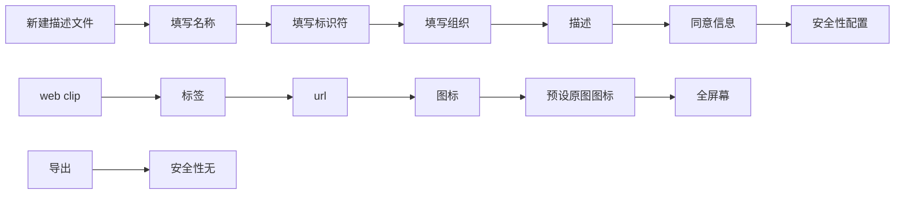

[toc]

### win10为app生成ios webclip免签

#### win10 下载工具

> baidu或google 搜索iphone配置实用工具，下载安装 会出现打不开情况 百度搜索解决方案 一共要复制两个文件过去.
>
> 


### 常见问题

完美解决win10下iphone配置实用工具找不到“apple mobile device support”
（位置即是安装路径所在位置，下面是默认安装位置）
1、进入如下目录
“C:\Program Files (x86)\Common Files\Apple\Mobile Device Support\”
复制MobileDevice.dll到
"D:\iPhone 配置实用工具\"下
2、进入如下目录
“C:\Program Files (x86)\Common Files\Apple\Apple Application Support”
复制SQLite3.dll到
“D:\iPhone 配置实用工具”下

#### 开始配置




> 此时会得到一个.mobilconfig结尾的文件

#### 使用ssl证书签名

> 无所谓什么域名的ssl证书，只有没过期就行， 导出为apache证书，上传到linux服务器，使用openssl
>
> key crt pem

##### 生成已签名配置文件  生成后去下载描述文件就会是验证的文件，

```bash
openssl smime -sign -in unsigned.mobileconfig -out signed.mobileconfig -signer mbaike.crt -inkey mbaike.key -certfile ca-bundle.pem -outform der -nodetach
```


命令解释,用法

-sign  -in  把原本unsigned.mobilconfig 文件 生成签名的文件signed.mobileconfig， -signer 是之前导出的apache证书，mabike.crt   -inkey  就是之前生成证书的*.key文件， -certfile  就是证书的ca_bundle.crt 文件，把后缀crt改下pem 不改也可以 ,  -outform der  输出格式为der  -ondetach   用不透明的签名


```
OpenSSL命令---smime
openssl smime [-encrypt] [-decrypt] [-sign] [-verify] [-pk7out] [-nointern] [-nosigs] [-noverify] [-nocerts] 
[ -nodetach] [-noattr] [-binary] [-in file] [-inform SMIME|PEM|DER] [-certfile file] [-signer file] [-recip file] 
[-passin arg] [-inkey file] [-keyform PEM |ENGINE] [-out file] [-outform SMIME|PEM|DER] [-content file] 
[-to addr] [-from ad] [-subject s] [-text] [-CApath directory] [-CAfile filename] [-crl_check] [-crl_check_all] 
[-indef] [-noindef] [-stream] [-rand file(s)] [-md digest] [cert.pem…] [-des] [-des3] [-rc2-40] 
[-rc2-64] [-rc2-128]

```

```
选项说明：

-encrypt：用给定的接受者的证书加密邮件信息。输入文件是一个消息值，用于加密。输出文件是一个已经被加密了的MIME格式的邮件信息。

-decrypt：用提供的证书和私钥值来解密邮件信息值。从输入文件中获取到已经加密了的MIME格式的邮件信息值。解密的邮件信息值被保存到输出文件中。

-sign：用提供的证书和私钥值来签名邮件信息值。输入文件是一个消息值，用于签名。输出文件是一个已经被签名了的MIME格式的邮件信息。

-verify：验证已经签名了的邮件信息值。输入文件和输出文件都是已经签名了的邮件信息值。同时支持清除文本以及不透明的签名。

-pk7out：将一个PEM格式的输入信息转换为PKCS#7结构。

-nointern：对签名者来说，不从消息中查找证书。

-nosigs：不去验证签名值。

-noverify：不去验证签名者的证书信息。

-nocerts：当签名的时候不包含签名者的证书信息值。

-nodetach：用不透明的签名。

-binary：不转换二进制消息到文本消息值。

-in file：输入消息值，它一般为加密了的以及签名了的MINME类型的消息值。

-inform SMIME|PEM|DER：输入消息的格式。一般为SMIME|PEM|DER三种。默认的是SMIME。

-certfile filename：添加filename中所有的证书信息值。

-signer file：一个签名证书，当签名或放弃一个签名数据时使用。这个选项可以被用多次。如果一个消息已经被验证并验证通过，则将签名者的证书放到file中。

-recip file：存放提供者的证书，主要用于解密消息值。这个证书必须匹配多个提供者的消息。

-passin arg：私钥保护口令来源。

-inkey file：私钥存放地址，主要用于签名或解密数据。这个私钥值必须匹配相应的证书信息。如果这个选项没有被指定，私钥必须包含到证书路径中（-recip、-signer）。

-keyform PEM |ENGINE：私钥格式。一般为PEM 、ENGINE格式。

-out file：已经被解密或验证通过的数据的保存位置。

-outform SMIME|PEM|DER：输出格式。一般为SMIME、PEM、DER三种。默认的格式是SMIME。

-content file：包含分离的上下文路径，它仅仅只能用于verify操作。

-to addr：有关的邮件信息值头部。接收的地址。

-from ad：有关的邮件信息值头部。发送的地址。

-subject s：颁发者信息值。

-text：打印出S/MIME邮件的各个部件。

-CApath directory：设置信任CA文件所在路径，此路径中的ca文件名采用特殊的形式：xxx.0，其中xxx为CA证书持有者的哈希值，它通过x509 -hash命令获得。

-CAfile filename：某文件，里面是所有你信任的CA的证书的内容。当你要建立client的证书链的时候也需要用到这个文件。

-crl_check、-crl_check_all：检查客户端的证书是否在CA的废除列表中。CRL（s）在证书文件中。crl_check_all表示要检查所有的CA证书中的废除列表。

-indef、-stream：这两个选项对I/O流进行编码操作。

-noindef：不对数据进行编码操作。

-md digest：当签名或放弃签名操作时用的摘要算法。默认的摘要算法为sha1。

-rand file(s)：指定随机数种子文件，多个文件间用分隔符分开，windows用“;”，OpenVMS用“,“，其他系统用“：”。

cert.pem：提供者的证书信息。

-des, -des3, -seed, -rc2-40, -rc2-64, -rc2-128, -aes128, -aes192, -aes256，-camellia128, -camellia192, -camellia256：指定的私钥保护加密算法。默认的算法是rc2-40。

退出代码：

返回值如下：

0：操作成功。

1：命令选项中有一个错误产生。

2：输入文件中的文件有一个不能读取。

3：在创建PKCS#7文件或读取MIME格式消息时出错。

4：解密或验证签名时出现错误。

5：消息已经被验证但是一个错误发生。
```


直接执行这里就可以，上面的命令只是解释。

##### 输入私钥密码

```bash
openssl rsa -in mbaike.key -out mbaikenopass.key
```

##### 写入签名

```bash
openssl smime -sign -in unsigned.mobileconfig -out signed.mobileconfig -signer mbaike.crt -inkey mbaikenopass.key -certfile ca-bundle.pem -outform der -nodetach
```

> 然后直接放到网站上给用户下载就可以啦！